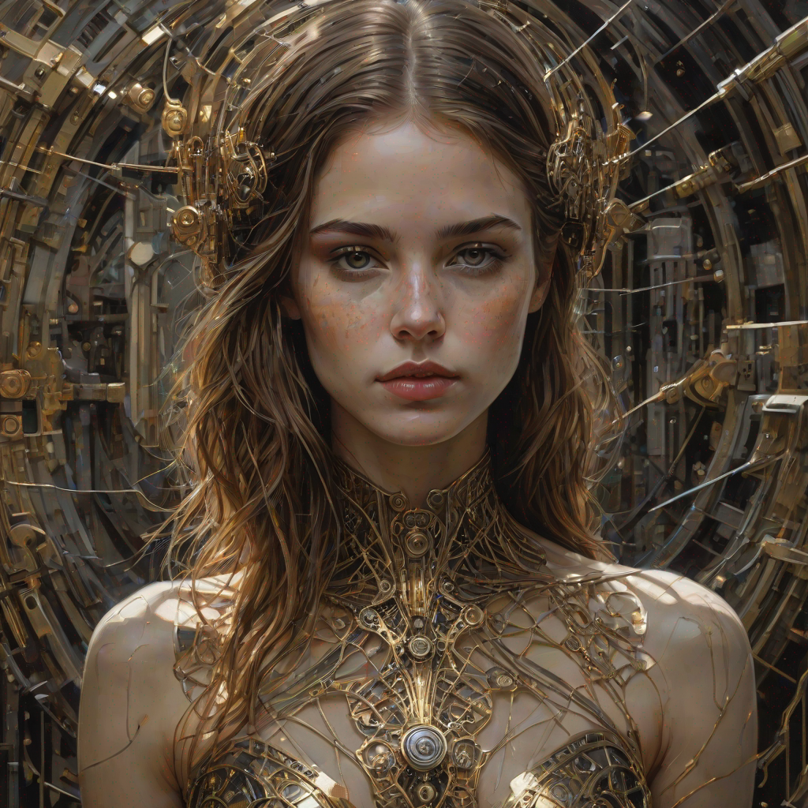

# dreamshaper-xl-turbo Cog

This is an implementation of [dreamshaper-xl-turbo](https://huggingface.co/Lykon/dreamshaper-xl-turbo) as a [Cog](https://github.com/replicate/cog) model.

## Development

Follow the [model pushing guide](https://replicate.com/docs/guides/push-a-model) to push your own fork of SDXL to [Replicate](https://replicate.com).

## Basic Usage

for prediction,

    cog predict -i prompt="In Casey Baugh's evocative style, art of a beautiful young girl cyborg with long brown hair, futuristic, scifi, intricate, elegant, highly detailed, majestic, Baugh's brushwork infuses the painting with a unique combination of realism and abstraction, greg rutkowski, surreal gold filigree, broken glass, (masterpiece, sidelighting, finely detailed beautiful eyes: 1.2), hdr, realistic painting, natural skin, textured skin, closed mouth, crystal eyes, butterfly filigree, chest armor, eye makeup, robot joints, long hair moved by the wind, window facing to another world, Baugh's distinctive style captures the essence of the girl's enigmatic nature, inviting viewers to explore the depths of her soul, award winning art"

